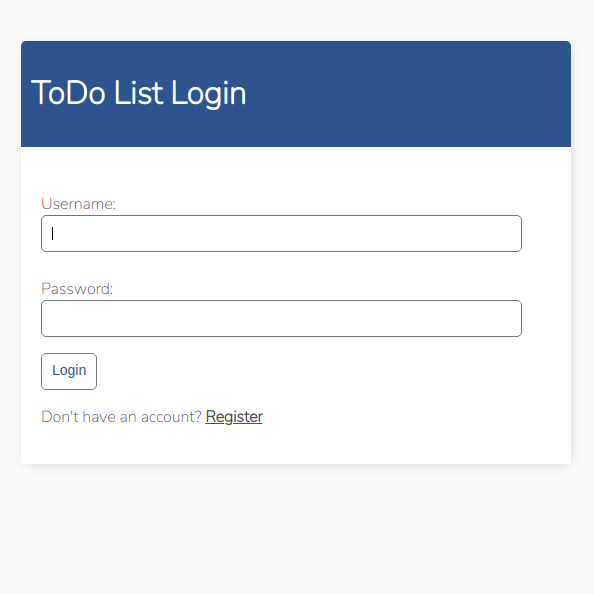
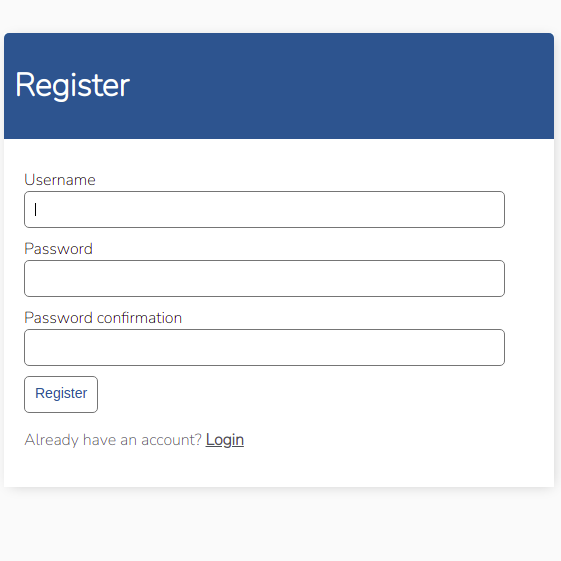
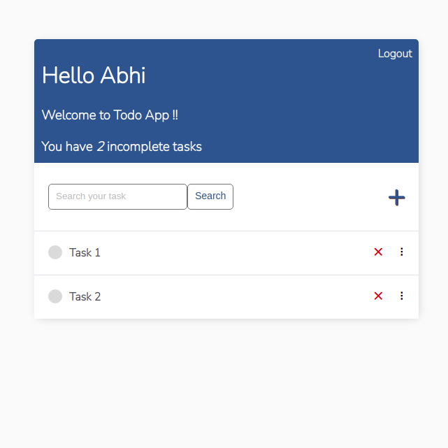
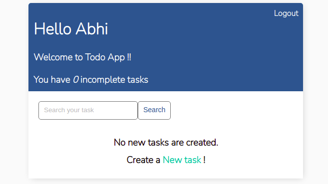

# Django To Do list Task (Newton School)
To Do list app with User Registration, Login, Search and full Create Read Update and DELETE functionality.
## How to make it work

open terminal in linux or command prompt in windows

* clone the repository
	> git clone https://github.com/Abhishekkumar02/Django_TODO_App
	>
	> cd Django_TODO_App

* make virtual environment (optional)
	* linux
		> sudo apt install python3-venv
		>
		> python3 -m venv my-project-env
		>
		> source my-project-env/bin/activate
	* windows
		> pip install virtualenv
		>
		> virtualenv my-project-env
		>
		> my-project-env/Script/activate

* Run requirements.txt file
  ```bash
   pip install -r requirements.txt
  ```
  
* To run the project goto the project dir (Django_TODO_App) and run the following command
    ```bash
     python3 manage.py runserver
    ```
   Once the server is start and running, visit [http://localhost:8000](http://localhost:8000)
   
 # Screenshots
 ## Login Page

## Register Page

## Task View page

## Home page


 Thank you
 
 Abhishek kumar
